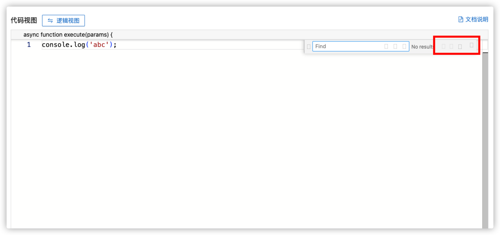
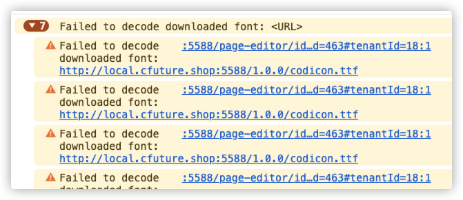
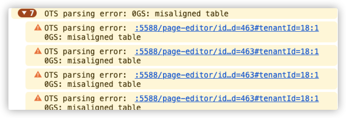
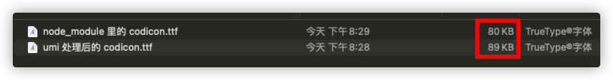
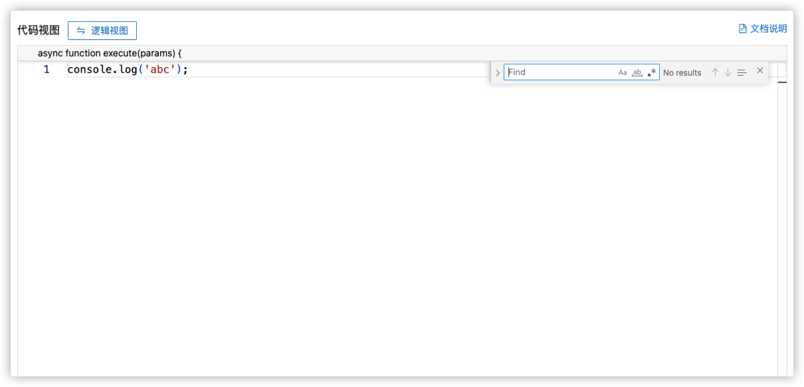

# 在 umi 中使用 monaco editor 后 icon 不显示的问题

## 背景

在低代码平台上有个功能模块是基于组件事件的逻辑搭建，原先的交互形式是基于可视化的界面拖拽进行相关逻辑配置的。现在需要支持了新的交互，用代码的形式编写逻辑。即基于组件事件的逻辑搭建既支持图形视图又支持代码视图。

在调研代码编辑器时，考虑到扩展的语法提示以及更多的功能支持，再加上前端普通使用 `vscode` 的情况下，选择了 `monaco editor` 作为代码视图的编辑器。

## 问题

由于某些历史原因，低代码平台项目用的是 `umi` 4.x 的版本，低代码编辑器用的 `umi` 3.x 的版本（编辑器以 `npm` 包的形式提供给低代码平台）。两个项目的 `umi` 版本虽然不一致，但经过笔者的一系列改动后，编辑器和低代码平台顺利使用 `monao editor@0.20.0` 。

很明显，`monaco editor@0.20.0` 版本太旧了，最新版本是 0.50.0，于是将两项目的 `monaco editor` 版本升级到 0.50.0。实际操作后，编辑器由于使用了 `umi` 3.x 版本，无法使用 `monaco editor@0.50.0` 。考虑到最终用户使用的是低代码平台，决定编辑器项目继续使用 `monaco editor0.20.0`，低代码平台项目使用 `monaco editor@0.50.0`。

低代码平台项目在部署后，线上能够使用到 `monco editor` 进行代码逻辑编写，但发现 `monaco editor` 的 `icon` 不展示了，又开始新的一轮问题排查。

## 解决思路

起先，经过网上的资料搜索，怀疑是 `umi` 无法处理 `ttf` 字体，于是改了 `umi` 的配置文件，但发现未能解决问题

> *后面看到 `webpack5`（ `umi@4.x` )  自带了对于字体、图片等资源的处理。*

再后来，查资料怀疑可能是 `css-loader@6.x` 处理 `css` 文件使用外部资源路径的问题，调整了 `ttf` 生成的资源路径，但未能解决。

后面先去忙其他的需求了。过来几天又继续解决。这次注意到不一样的东西了。

在控制台中出现了这样的警告。沿着这个警告的信息去网上搜，看到说是“**多半是字体库的信息不全或者已损坏**”。于是把 `node_modules` 里的 `monaco editor` 的字体存到本地项目里，继续尝试，也未成效。

继续排查后面的警告内容，这次终于确定了问题所在。

`icon` 无法显示的问题是，经过 `umi` 处理后的 `ttf` 字体，浏览器无法解析。并通过处理后的 `ttf` 字体大小和原 `ttf` 字体大小做比较，资源大小不一致也能佐证笔者这个想法。于是将原有的 `ttf` 字体转化为 `woff` 字体后，再经过本地 `css` 文件引入 `woff` 字体资源后，`icon` 终于显示了。

## 后续

之后做了个简单的 `demo` ，也就是 `umi` + `monaco editor` 的项目，`icon` 能正常显示。所以是低代码项目本身构建的问题，至于什么问题就暂时先不深究了。

